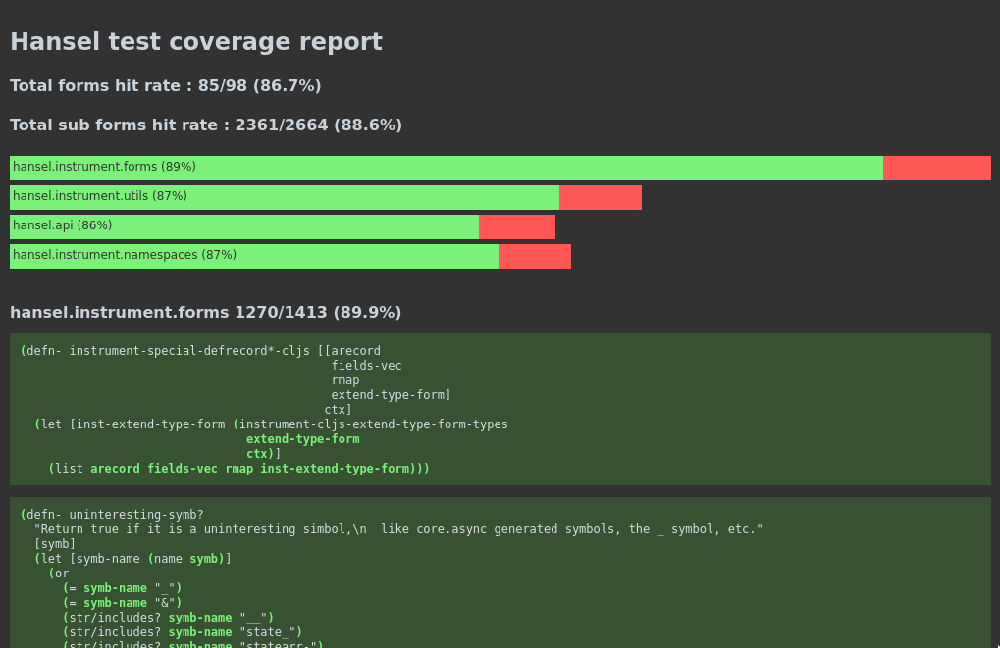

# Clofidence

Bolster your Clojure[Script] test suite confidence. 



Clofidence is a test coverage tool for Clojure and ClojureScript. 
It will instrument your codebase using [ClojureStorm](https://github.com/flow-storm/clojure) or [ClojureScriptStorm](https://github.com/flow-storm/clojurescript), 
then run your tests and generate a test coverage report.

[](https://clojars.org/com.github.flow-storm/clofidence)

## Clojure quick start

### With the Clojure Cli

Add an alias to your `deps.edn` like this :

```clojure
{....
 :aliases 
 {:test {...}
  :clofidence {:classpath-overrides {org.clojure/clojure nil}
               :extra-deps {com.github.flow-storm/clojure {:mvn/version "LATEST"} ; >= 1.11.1-15
                            com.github.flow-storm/clofidence {:mvn/version "LATEST"}}
               :exec-fn clofidence.main/run
               :exec-args {:report-name "MyApp"
                           :test-fn cognitect.test-runner.api/test
                           :test-fn-args [{}]}
               :jvm-opts ["-Dclojure.storm.instrumentOnlyPrefixes=my-app"
                          "-Dclojure.storm.instrumentSkipPrefixes=my-app.unwanted-ns1,my-app.unwanted-ns2"
                          "-Dclojure.storm.instrumentSkipRegex=.*test.*"
                          ]}}}
```

Please make sure you have the latest versions of ClojureStorm and Clofidence.

With __Clofidence__ configured, every time you want to generate a coverage report you run :

```bash
$ clj -X:test:clofidence
```

After running the tests, it should generate a folder (by default called clofidence-output) with a index.html pointing to every ns details.
Click [here](/examples/clojurescript-1.60.tgz) to download the Clofidence report for the ClojureScript compiler v1.11.60 as an example.

### Configuration

The example above assumes your aliases contain a `:test` alias that will put the tests paths and test-runner 
on the classpath, but this will depend on your particular test setup.

There is a lot going on in the configuration, so let's walk over it :

  * First, we need to disable the official Clojure compiler, since we are going to replace it with ClojureStorm
  * Next, we add the latest ClojureStorm and Clofidence dependencies
  * `:exec-fn` and `:exec-args` tells the Clojure cli what  Clofidence main entry point is and with what arguments it should call it
    * `:report-name` just configures the report header and file name
    * `:test-fn` tells Clofidence what function will run your tests
    * `:test-fn-args` are the arguments to the function defined in `:test-fn`
    * `:output-folder` there an optional output folder, to provide a folder name, otherwise `clofidence-output` will be used
  * Finally we need to tell Clofidence which namespaces to include and which to skip for the coverage
    * `instrumentOnlyPrefixes` should be a comma separated list of namespaces prefixes to include. Adding `my-app` will include everything 
    under `my-app.core` and `my-app.web.routes`.
    * `instrumentSkipPrefixes` can be used in the same way, but to skip unwanted namespaces.
    * `instrumentSkipRegex` should be a regex to match namespaces to skip

## ClojureScript quick start 

### With shadow-cljs

Minimum requirements :

* nodejs >= 18.0.0 (when running tests with node)
* shadow-cljs >= 2.25.4
    
Add an alias to your `deps.edn` like this :

```clojure
{....
 :aliases 
 {:test {...}
  :clofidence {:classpath-overrides {org.clojure/clojurescript nil}
               :extra-deps {thheller/shadow-cljs {:mvn/version "2.28.10" :exclusions [org.clojure/clojurescript]}
                            com.github.flow-storm/clojurescript {:mvn/version "LATEST"} ;; >= 1.11.132-6
                            com.github.flow-storm/clofidence {:mvn/version "LATEST"}}
               :exec-fn clofidence.main/run-cljs
               :exec-args {:report-name "MyApp"}
               :jvm-opts ["-Dcljs.storm.instrumentOnlyPrefixes=org.foo,dev"
                          "-Dcljs.storm.instrumentSkipPrefixes=dev.skipped"
                          "-Dcljs.storm.instrumentSkipRegex=.*test.*"
                          "-Dcljs.storm.instrumentEnable=true"]}}}
```

Modify your shadow-cljs.edn test builds (nodejs and browser currently supported) like this :

```clojure
{:deps {:aliases [:clofidence :test]}
 :dev-http {8021 "out/test"}
 :builds
 {:test-browser {:target :browser-test
                 :test-dir "out/test"
                 :runner-ns clofidence.shadow-test.browser
                 :devtools {:preloads [clofidence.storm]}}
  :test-node {:target :node-test
              :output-to "out/node-tests.js"
              :main clofidence.shadow-test.node/main
              :devtools {:preloads [clofidence.storm]}}}}
```

And then spawn a clofidence server with :

```bash
$ clj -X:test:clofidence
```

You should now be able to run your nodejs or browser tests as you normally do with shadow-cljs which for the browser will be something like :

```bash
$ npx shadow-cljs compile :test-browser # compile the tests
$ npx shadow-cljs server # start the dev server
$ firefox http://localhost:8021 # run the tests 
```

while for nodejs will be something like :

```bash
$ npx shadow-cljs compile :test-node # compile the tests
$ node out/node-tests.js # run the tests
```
After the tests run on the JS runtime, the results will be sent to your Clofidence server (the one you spawned before) which will generate
the reports on disk in its current folder.

You can now open your tests reports with something like :

```bash
$ firefox clofidence-output/index.html
```

### Configuration

The example above assumes your aliases contain a `:test` alias that will put the tests paths
on the classpath, but this will depend on your particular test setup.

There is a lot going on in the configuration, so let's walk over it :

#### On deps.edn
  * First, we need to disable the official ClojureScript compiler, since we are going to replace it with ClojureScriptStorm
  * Next, we add the latest ClojureScriptStorm, Clofidence and shadow-cljs dependencies, excluidng the official ClojureScript compiler that comes with shadow-cljs
  * `:exec-fn` and `:exec-args` tells the Clojure cli to run the clofidence server and with what arguments it should call it
    * `:report-name` just configures the report header and file name
    * `:output-folder` there an optional output folder, to provide a folder name, otherwise `clofidence-output` will be used
  * Finally we need to tell Clofidence which namespaces to include and which to skip for the coverage
    * `instrumentOnlyPrefixes` should be a comma separated list of namespaces prefixes to include. Adding `my-app` will include everything 
    under `my-app.core` and `my-app.web.routes`.
    * `instrumentSkipPrefixes` can be used in the same way, but to skip unwanted namespaces.
    * `instrumentSkipRegex` should be a regex to match namespaces to skip
        
    
## Reports

[Here](/examples/clojurescript-1.60.tgz) you can download and see the **Clofidence** report for the ClojureScript compiler v1.11.60.

Extracting that tarball will give you a folder containing a index.html with an overview pointing to the rest of the files
which contains each namespace details.

### index.html

#### Header counters

The **Total forms hit rate** shows how many top level forms were at least touched once by the tests, out of all the instrumented forms.

The **Total sub forms hit rate** shows how many sub-expressions were hit out of all instrumented ones.

#### Header overview

The header overview shows one bar per namespace, and how much of it has been covered.

The size of the bars is proportional to the amount of code in the namespaces.

Clicking on the namespace name will take you to the namespace details.

### Namespace detilas

#### Form details
  
Right after the overview, the report includes a list of all your instrumented forms, grouped by namespaces and sorted by coverage.

Forms will have a green background if the coverage is > 50%, a yellow background between 1% and 50% and a red background for forms with 0% coverage.

Each forms contains details of what sub-expressions were hit at least once. This is useful to identify parts of your forms that aren't being exercised
by the tests.

Hitted sub-expressions will be highlighted in green while hittable but not hit ones will be highlighted in red.
Skimming over the red ones should give you an overview of uncovered conditional branches, uncovered functions signatures, etc.


#### Which forms are included in the report?

By default, only forms with the first symbol name being one of : `defn`, `defn-`, `defmethod`, `extend-type`, `extend-protocol`, `deftype`, `defrecord` 
and `def` forms which define functions will be included.

If you have other types of forms (like the ones defined by some macros), you can include them by using `:extra-forms` in the configuration 
parameters. It takes a set of symbols like `:extra-forms #{defroutes}`.

If instead of using the default and allowing some extra forms you prefer the other way around, you can use the `:block-forms` config.
If you config it like `:block-forms #{}`, all forms will be included (with the exception of a few, see next) and you can block some
by adding them to the set, like `:block-forms #{my-annoying-form}`.

Even with `:block-forms #{}` there are some forms which are always excluded, which are `ns`, `defprotocol`, `quote`, `comment`, `def` with constants
which doesn't make sense.
